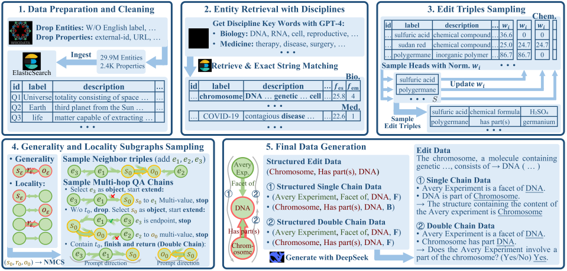
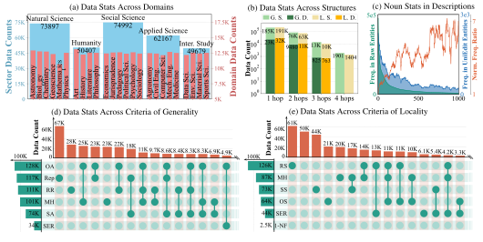

<div align="center">
  
</div>
<!-- # <div align="center" style="font-variant: small-caps;">UniEdit</div> -->
<!-- : A Unified Knowledge Editing Benchmark for Large Language Models -->


<div align="center">
  
  <a href="https://opensource.org/licenses/MIT"></a>
  <a href="https://arxiv.org/abs/2505.12345"></a>
  <a href="https://huggingface.co/datasets/qizhou/UniEdit"></a>
  
  
</div>

---

# Catalogue
- [Catalogue](#catalogue)
- [Introduction](#introduction)
- [Statistics of UniEdit](#statistics-of-uniedit)
- [Installation](#installation)
- [Generation of UniEdit](#generation-of-uniedit)
  - [Download and Start Elasticsearch Backend](#download-and-start-elasticsearch-backend)
  - [Generation Pipeline](#generation-pipeline)
- [Evaluation with UniEdit](#evaluation-with-uniedit)
  - [Download UniEdit](#download-uniedit)
  - [Prepare Backbones](#prepare-backbones)
  - [Training \& Testing](#training--testing)
- [Citation](#citation)

# Introduction
UniEdit is a large-scale open-domain benchmark for large language model knowledge editing, containing 311K samples. It is designed to systematically and fine-grainedly evaluate editing algorithms across three key dimensions: Reliability, Generality, and Locality.

To overcome the limitations of existing benchmarks—such as narrow knowledge coverage, limited structural diversity, and incomplete evaluation criteria—UniEdit is constructed from 29.9M entities in Wikidata, covering 25 domains across five major sectors: natural sciences, humanities, social sciences, applied sciences, and interdisciplinary studies. This provides extensive knowledge coverage and diverse evaluation settings (e.g., multi-hop reasoning, same-entity reasoning, relation reversal, etc.).

The figure below presents a data composition example, which generates corresponding natural-language editing and evaluation samples from sampled structured fact chains.


<div align="center">
  
</div>


UniEdit introduces the NMCS (Neighborhood Multi-hop Chain Sampling) algorithm, a unified sampling method that generates diverse structural samples for generality and locality based on a given factual triple. This  expands the coverage of existing evaluation criteria. We use Deepseek-V3 to automatically convert the structured data into natural-language form. The figure below illustrates the full generation pipeline of UniEdit.


<div align="center">
  
</div>


# Statistics of UniEdit
The table below compares UniEdit with existing benchmarks in terms of coverage across various evaluation features, including Rephrase (Rep), Multi-Hop (MH), Relation Reversal (RR), Same-Entity Reasoning (SER), Subject Alias (SA), Object Alias (OA), Subject Specificity (SS), Relation Specificity (RS), Object Specificity (OS), 1-N Forgotten (1-NF), Combinations of the above evaluation Criteria (CC), and Open-Domain (OD). 

<div align="center">
  
</div>

The figure below shows the data distribution of UniEdit across: (a) domains, (b) multi-hop counts and query chain structures (G., L., S., and D. represent generality, locality, single, and double, respectively), and (d, e) the top 15 combinations of recognized evaluation criteria. (c) displays the frequency statistics of nouns in entity descriptions. 


<div align="center">
  
</div>

The figure below shows the word cloud distribution of the head-entity descriptions for editing samples across different domains in UniEdit.


<div align="center">
  
</div>


# Installation
Please use Python 3.11.9 to get started with our implementation; simply install Conda and run:
```bash
git clone https://github.com/qizhou000/UniEdit.git
cd UniEdit
conda create -n UniEdit python=3.11.9
conda activate UniEdit
pip install -r requirements.txt
```

# Generation of UniEdit
## Download and Start Elasticsearch Backend
We use Elasticsearch to retrieve head entities for each domain based on domain-specific keywords.
To begin, please download Elasticsearch 8.17.2 from: `https://www.elastic.co/downloads/past-releases/elasticsearch-8-17-2`, place the package into the `./elasticsearch` directory, and extract it.
Then start the Elasticsearch backend:
```bash
./elasticsearch/elasticsearch-8.17.2/bin/elasticsearch
```

## Generation Pipeline
The pipeline and toolkit code for UniEdit generation are located in the `./uniedit_construction/preprocess_pipeline` directory.
Among these steps, pipeline steps 1, 2, 3, 4, 5, 6, and 11 operate on the global data, while the remaining steps process the data independently for each domain. The scripts for these domain-specific steps can be found in the `./scripts/uniedit_gen` directory.

# Evaluation with UniEdit

## Download UniEdit
You can download the UniEdit dataset from HuggingFace ([here](https://huggingface.co/datasets/qizhou/UniEdit)). The file structure is as follows:
```
📁UniEdit
├── 📁train
│   ├── 📄agronomy.json
│   ├── 📄art.json
│   └── ...
└── 📁test
    ├── 📄agronomy.json
    ├── 📄art.json
    └── ...
```
Each knowledge domain corresponds to a single JSON file in the training or test set. The data structure of each JSON file is as follows:
```python
{
    "<sample_id>": {
        "edit": {
            "prompt": str, # prompt string
            "target": str, # target string
            "subject": str, # subject string
            "head_entity": { # properties of the head entity
                "id": str, "label": str,
                "description": str, "aliases": list[str]
            },
            "property": { # properties of the relation
                "id": str, "label": str,
                "description": str, "aliases": list[str],
                "single_value": bool # whether the head entity and the relation correspond to a single-valued tail
            },
            "tail_entity": { # properties of the tail entity
                "order_in_property": 0, # the index of this tail entity among all values associated with the head–relation pair
                "datatype": str, # such as "wikibase-item"(entity), "quantity"(numeric type), etc.
                "value": dict # structure depends on the datatype
            },
            "single_inverse": bool # whether the tail entity and the reversed relation correspond to a single-valued head
        },
        "generality": {
            "0": { # only one generality and locality sample is generated for each edit sample
                "path_type": str, # "single" or "double", indicating single-path multi-hop reasoning or same-entity reasoning
                "prompt": str, # prompt string
                "target": str, # target string
                "paths": list[list[str]], # the encoded multi-hop reasoning chains. For example,
                                          # [["t_e", "r_e", "h_e", "b", "m"]] represents a chain containing only one fact: the edit fact itself.
                                          # Here, "b" means the relation is reversed, i.e. r_e'.
                                          # "m" indicates that (t_e, r_e', ·) has multiple values.
                "one_hops": [ # all one-hop facts in the reasoning chain; exists only when `path_type` is "single"
                    {
                        "path": list[str], # encoded one-hop fact, e.g., ["e_0", "r_0", "t_e"] meaning a hop linked to the tail of the edit sample
                        "prompt": str,
                        "subject": str,
                        "target": str,
                        "reverse_in_multi_hop": bool, # whether this hop is reversed within the chain
                        "reversed": { # QA for the reversed one-hop fact (only appears if `reverse_in_multi_hop` is True)
                            "prompt": str,
                            "target": str
                        },
                        "head_entity": dict, # same structure as defined under "edit"
                        "property": dict,    # same structure as defined under "edit"
                        "tail_entity": dict, # same structure as defined under "edit"
                        "single_inverse": bool # same definition as under "edit"
                    }, ...
                ],
                "single_path1": { # exists only when `path_type` is "double"; facts and prompts of one direction of the reasoning chain
                    "path_type": "single",
                    "prompt": str,
                    "target": str,
                    "paths": list[list[str]],
                    "one_hops": list[dict]
                },
                "single_path2": dict # exists only when `path_type` = "double"; the other direction of the reasoning chain
            }
        },
        "locality": {
            "0": {
                "loc_type": str, # the starting point from which the locality sample is derived: "none", 
                                 # "tail of edit", "head of edit", or "property of edit"
                # All fields below follow the same definitions as in "generality"
                "path_type": str,
                "prompt": str,
                ...
            }
        }
    }
}
```

Place the UniEdit data in the `./data` folder. 
To check which criteria each sample belongs to, you can run:
```python
from dataset.llm import UniEdit

i = 0
data = UniEdit('data/UniEdit/test')
print(data.get_data_by_ids([i]))
```

## Prepare Backbones
Please download the backbone weights and place them in the `./models` folder.
The model URLs are:

- GPT2-XL-1.5B: https://huggingface.co/openai-community/gpt2-xl
- GPT-J-6B: https://huggingface.co/EleutherAI/gpt-j-6b
- LLaMa-3.1-8B: https://huggingface.co/meta-llama/Llama-3.1-8B

## Training & Testing
For scripts related to editor training and testing on UniEdit, please refer to `./scripts/editor_train_test`.

Testing results will be saved in the `./eval_results` directory.

For visualization of the results reported in the paper, please refer to the scripts `./fig_heat_map_discipline_results.py` `./fig_radar_eval_pattern_results.py`, and `./fig_serac_domain_generalization.py`. 
The Figures are saved in `./figs/uniedit`.


# Citation
If you use UniEdit in your research or projects, please remember to cite our paper :).
```bibtex
@article{Chen2025UniEdit,
  author       = {Qizhou Chen and
                  Dakan Wang and
                  Taolin Zhang and
                  Zaoming Yan and
                  Chengsong You and
                  Chengyu Wang and
                  Xiaofeng He},
  title        = {UniEdit: {A} Unified Knowledge Editing Benchmark for Large Language
                  Models},
  journal      = {CoRR},
  volume       = {abs/2505.12345},
  year         = {2025},
  url          = {https://doi.org/10.48550/arXiv.2505.12345},
  doi          = {10.48550/ARXIV.2505.12345},
  eprinttype    = {arXiv},
  eprint       = {2505.12345},
  timestamp    = {Tue, 24 Jun 2025 07:37:11 +0200},
  biburl       = {https://dblp.org/rec/journals/corr/abs-2505-12345.bib},
  bibsource    = {dblp computer science bibliography, https://dblp.org}
}
```

